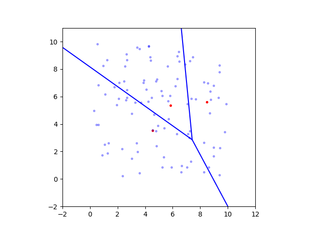

# Voronoi Diagram with D* Lite Algorithm for Safe Robot Navigation in Dynamic Environments

The present code base provides a solution for the robot navigation problem using a Voronoi Diagram for Roadmap representation of the enviornment where the robot is supposed to move. the D* Lite algorithm was implemented in order to solve the graph generated by the voronoi Diagram and plan/replanthe shortest path to a given goal node (position). 

The code implementation has a CLI to execute it as follows.

`python main.py start goal sites limit_axex rdm_seed obstacle_sim hid_obs vis_map_nodes` Where the meaning of each argument is defined as follows.

* **start**: Specifies the starting node where the robot is located. Type of value (int)
* **goal**: Specifies the target node where the robot aims to reach. Type of value (int)
* **sites**: Specifies the number of random point obstacles on the map. Type of value (int)
* **limit_axes**: Specifies if the axes of the map are to be limited, this is specially usefull for visualization purposes. Type of value (0 or 1)
* **rdm_seed**: Specifies a random seed for the ranndom number generator to follow. Type of value (int)
* **obstacle_sim**: It is used to enable or disable the simulation of hidden obstacles in the environment. Type of value (0 or 1)
* **hid_obs**: This is a comma separated list of nodes which end up being hidden obstacles. Type of value (comma separated int values)
* **vis_map_nodes**: This flag is used for only visualization purposes of the node numbers of the resultins voronoi diagram. Type of value (0 or 1)

 The implementation considers the Voronoi Diagram as a set of vertices and edges that define the workspace of the robot in an environment defined by point obstacles. The implementation outputs the simulation of the robot moving in the environment, planning and moving from a start node to a goal node.

### Voronoi Diagram Building process

### D* Lite (Showing Different values through robot's motion)

(Execution without hidden obstacles-> left. Execution with hidden obstacles-> right)

 ## Sample Executions Voronoi Diagram + D* Lite

`python main.py 1 9 10 0 53 1 4,12` 

(Execution without hidden obstacles-> left. Execution with hidden obstacles-> right)

`python main.py 52 75 50 1 53 1 65,4,83,36 `

(Execution without hidden obstacles-> left. Execution with hidden obstacles-> right)

[Video Demo Link](https://drive.google.com/file/d/1btEJqe3iGkNtObgyLYGfmwKZKwG-JMVj/view?usp=sharing).

